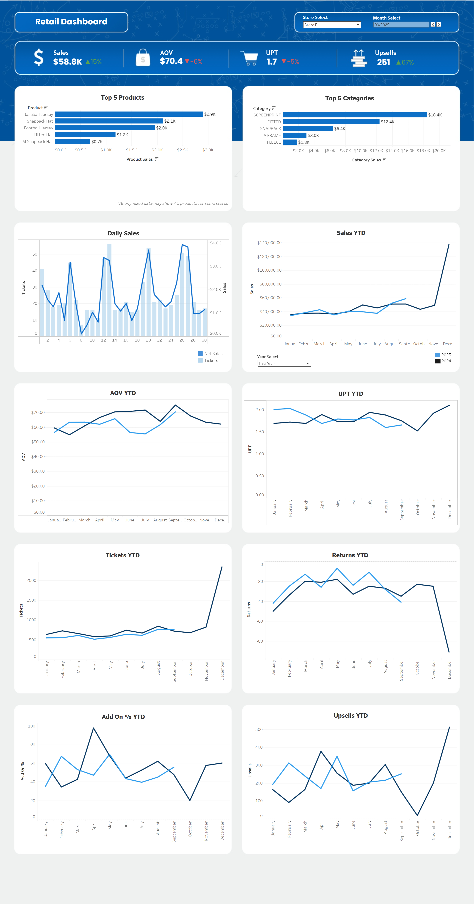

# Store Performance Dashboard

### Purpose

This interactive dashboard was created to provide retail management and executives with a convenient and comprehensive view of both company and store-level performance across key metrics. The year-over-year view enables convenient evaluation of metric trends against historical results to identify areas for improvement.

### Features:
* The KPI bar shows totals of Sales, AOV, UPT, and Upsells for the selected month.
* Percent changes next to metrics show whether that metric performed better or worse on the selected month last year.
* YTD line plots show each metrics performance trend over time.

### Functionality:
* "Store Select" changes every chart in the dashboard to the selected store.
* "Month Select" determines which months metrics are displayed on the KPI bar as well as the Top 5 and Daily Sales Charts.
* YTD metric charts can be compared to performance last year using the "Year Select" dropdown. 

 

The interactive dashboard can be accessed [here](https://public.tableau.com/app/profile/jacob.perovich/viz/StorePerformanceDashboard_17636125179960/Dashboard#1)

_*Data was anonymized to maintain confidentiality of real company data._    

