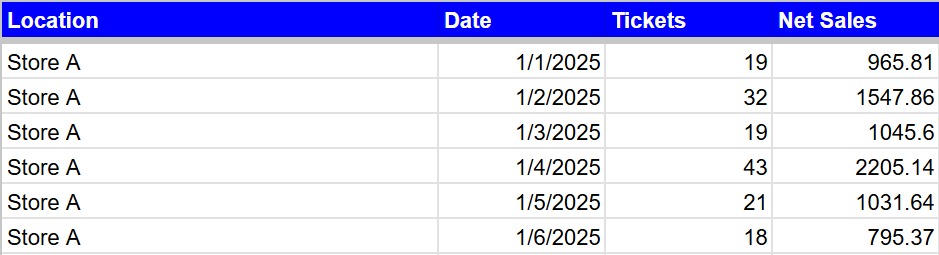
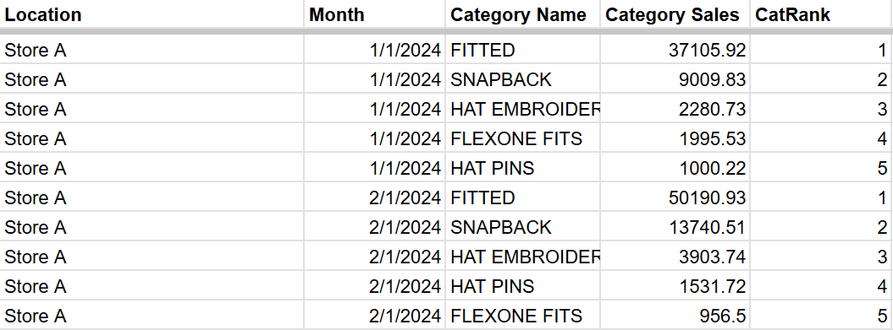
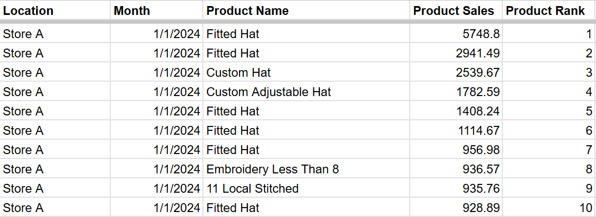
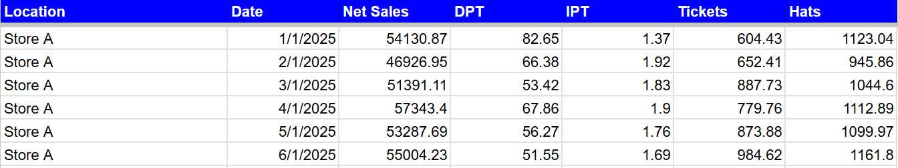

# SQL Queries


## Schema
The table YTD2025 was used for our queries:


<br>


## Queries
The following queries were used to aggregate data used in the dashboard

<br>

### Total Sales & Tickets Per Store & Day


```SQL
--Gathers total ticket count per location & day. Ignores tickets from online orders.
tickets AS (
  SELECT
    date, location,
    COUNT(DISTINCT Ticket_Id) AS ticketcount
  FROM YTD2025
  WHERE lower(payment_methods) <> 'ecommerce payment' OR payment_methods IS NULL
  GROUP BY date, location
)


--Gathers total sales and tickets per location & day.
SELECT
  location,
  date,
  MAX(ticketcount) as ticketcount,
  ROUND(SUM(Net_sales),2) as sales
FROM
YTD2025 
  LEFT JOIN tickets using(location, date)
GROUP BY location, date
ORDER BY location, date

```


Example Output:



<br>


### Top 5 Selling Categories Per Store & Month


```SQL
--total sales per category / location / month
Totals AS(
  SELECT
    Location,
    DATE_TRUNC(date, MONTH) as month,
    Category,
    SUM(Net_sales) as CatSales
  FROM YTD2025 
  GROUP BY location, month, Category
),

--Assigns ranking to categories based on sales.
ranking as(
  SELECT
    Location,
    Month,
    Category,
    CatSales,
    ROW_NUMBER() over(PARTITION BY location, month ORDER BY CatSales desc) as rn
  FROM
    totals
)

--Displays only the top 5 categories.
SELECT
  Location,
  Month,
  Category,
  CatSales,
  rn as CatRank
FROM
  ranking
WHERE rn < 6
ORDER BY location, month, rn

```


Example Output



<br>

### Top 10 Selling Products Per Store & Month


```SQL

--make changes to column names casing, spacing, and comments and orgin table name

--total sales per category / location / month
Totals AS(
SELECT
Location,
date_trunc(date, MONTH) as month,
Product_name,
sum(Net_sales) as ProductSales
FROM YTD2025
 group by location, month, Product_name
),


therows as(
select
Location,
Month,
Product_name,
ProductSales,
row_number() over(partition by location, month order by ProductSales desc) as rn
from
totals
)


select
Location,
Month,
Product_name,
round(ProductSales,2) as ProductSales,
rn as ProductRank
from
therows
where rn < 11
order by location, month, rn


```


Example Output



<br>

### Metrics & Average Metrics Per Store & Month

```SQL

--top to bottom Make changes to column names casing, spacing, and comments and orgin table name
WITH Tickets AS(
  SELECT
    date,
    location,
    COUNT(DISTINCT ticket_id) as ticketcount
  FROM YTD2025
  WHERE
    LOWER(payment_methods) <> 'ecommerce payment' OR payment_methods IS NULL
  GROUP BY date, location
),


FranSales AS (
  SELECT
    date, Location,
    ROUND(SUM(Net_sales), 2) AS Sales
  FROM YTD2025
  GROUP BY date, Location
),


Bag_dollars AS(
  SELECT
    date, location,
    COALESCE(sum(Net_sales),0) as Bag_Fee
  FROM YTD2025
  WHERE Product_name = 'Bag_Fee'
  GROUP BY date, location
  ),


--Start of metrics

net_sales_per_store AS (
  SELECT
      Location,
      Date,
      ROUND(SUM(Net_sales), 2) AS Net_Sales
  FROM YTD2025
  WHERE product_name <> 'Bag_Fee'
  GROUP BY Date, Location
),


avg_ticket_totals AS (
  SELECT
    Location,
    date,
    ROUND(
    (COALESCE(fs.Sales,0) - COALESCE(b.Bag_Fee,0)) / NULLIF(ticketcount,0),2 ) AS DPT
  FROM tickets
    LEFT JOIN FranSales fs USING(location, date)
    LEFT JOIN Bag_dollars b USING(location, date)
),


upt_per_store AS (
  SELECT
    Location,
    Date,
    ROUND(SUM(quantity) / NULLIF(ticketcount,0),2) AS UPT
    FROM YTD2025
      LEFT JOIN 
      tickets t USING(location, date)
    WHERE
    (lower(payment_methods) <> 'ecommerce payment' OR payment_methods IS NULL)
    AND
    (product_name <> 'Bag_Fee')
    GROUP BY
    Date, Location, Ticketcount
),


SalesByCategory AS(
  SELECT
  date,
  Location,
    -- Hat categories
    SUM(CASE WHEN category IN ('VISOR', 'SNAPBACK', 'ROPER', 'A_FRAME', 'BUCKET', 'HATS',
         'UNSTRUCTURED_ADJ', 'FITTED', 'FLEXONE_FITS', 'STRUCTURED_ADJ') 
             THEN Quantity ELSE 0 END) AS Hats,


    -- Hat Sprays with logic
    SUM(CASE
          WHEN LOWER(product_name) IN('hat_spray', 'hat_spray_steam_bundle') THEN quantity
          WHEN Product_name = 'Jersey_Spray' THEN Quantity * 5
          WHEN Product_name = '12oz_Repelwell'
          OR product_name = 'DetraPel' THEN Quantity * 20
          ELSE 0
        END) AS Hat_Sprays,


    -- Other accessories
    SUM(CASE WHEN LOWER(product_name) IN('steamcurve', 'hat_spray_steam_bundle') THEN quantity ELSE 0 END) AS Hat_Steams,
    SUM(CASE WHEN Category = 'HAT_PINS' THEN Quantity ELSE 0 END) AS Hat_Pins,
    SUM(CASE WHEN Category = 'HAT_ACCESSORIESADD-ONS' THEN Quantity ELSE 0 END) AS Hat_Accessories,


    -- Total Accessories
    (
      SUM(CASE
          WHEN LOWER(product_name) IN('hat_spray', 'hat_spray_steam_bundle') THEN quantity
            WHEN Product_name = 'Jersey_Spray' THEN Quantity * 5
            WHEN Product_name = '12oz_Repelwell'
            OR product_name = 'DetraPel' THEN Quantity * 20
            ELSE 0 END)
      +
      SUM(CASE WHEN LOWER(product_name) IN('steamcurve', 'hat_spray_steam_bundle') THEN quantity ELSE 0 END)
      +
      SUM(CASE WHEN Category = 'HAT_PINS' THEN Quantity ELSE 0 END)
      +
      SUM(CASE WHEN Category = 'HAT_ACCESSORIESADD-ONS' THEN Quantity ELSE 0 END)
    ) AS Total_QT,


    -- Add_On % Rate
    ROUND(((
          SUM(CASE
          WHEN lower(product_name) IN('hat_spray', 'hat_spray_steam_bundle') THEN quantity
                WHEN Product_name = 'Jersey_Spray' THEN Quantity * 5
                WHEN Product_name = '12oz_Repelwell'
                OR product_name = 'DetraPel' THEN Quantity * 20
                ELSE 0 END)
          +
          SUM(CASE WHEN lower(product_name) IN('steamcurve', 'hat_spray_steam_bundle') THEN quantity ELSE 0 END)
          +
          SUM(CASE WHEN Category = 'HAT_PINS' THEN Quantity ELSE 0 END)
          +
          SUM(CASE WHEN Category = 'HAT_ACCESSORIESADD-ONS' THEN Quantity ELSE 0 END)
        ) *100.0
        /
        NULLIF(
          SUM(CASE WHEN Category IN ('SNAPBACK', 'ROPER', 'A_FRAME', 'BUCKET', 'HATS', 'VISOR',
                 'UNSTRUCTURED_ADJ', 'FITTED', 'FLEXONE_FITS', 'STRUCTURED_ADJ') 
                   THEN Quantity ELSE 0 END),
        0) ), 4
    ) AS Add_On_Percent,


--Percentage of hats sprayed (sum of hat sprays / hats sold)


ROUND(sum(case WHEN LOWER(product_name) IN('hat_spray', 'hat_spray_steam_bundle') THEN quantity else 0 END) *100.0
/
NULLIF(sum(case when category IN('SNAPBACK', 'ROPER', 'A_FRAME', 'BUCKET', 'HATS', 'VISOR',
                 'UNSTRUCTURED_ADJ', 'FITTED', 'FLEXONE_FITS', 'STRUCTURED_ADJ')
                   THEN Quantity ELSE 0 END),0),2) as Hats_Sprayed_Percent,


--Percent of jerseys sprayed sum of jerseys sprayed / sum of jerseys sold
COALESCE(ROUND(SUM(CASE WHEN product_name = 'Jersey_Spray' THEN quantity else 0 end) *100.0
/
NULLIF(SUM(CASE WHEN LOWER(Product_Name) LIKE '%jersey%' OR lower(product_name) LIKE '%jerseys%' THEN Quantity ELSE 0 END),0),2),0) as Jerseys_Sprayed_Percent,


--Returns
SUM(CASE WHEN quantity <0 then quantity end) as returns

FROM YTD2025
GROUP BY date, location
),


combined AS(
  SELECT
  sbc.location,
  sbc.date,
  Net_Sales,
  DPT,
  UPT,
  ticketcount,

  sbc.Hats,
  sbc.Hat_Sprays,
  sbc.Hat_Steams,
  sbc.Hat_Pins,
  sbc.Hat_Accessories,
  sbc.Total_QT,
  sbc.Add_On_Percent,
  Hats_Sprayed_Percent,
  Jerseys_Sprayed_Percent,
  Returns


  FROM SalesByCategory sbc
    LEFT JOIN avg_ticket_totals avg ON avg.date = sbc.date AND avg.location = sbc.location
    LEFT JOIN upt_per_store uptt ON uptt.date = sbc.date AND uptt.location = sbc.location
    LEFT JOIN net_sales_per_store net ON net.date = sbc.date AND net.location = sbc.location
    LEFT JOIN tickets t ON t.date = sbc.date AND t.location = sbc.location
),


--Store Averages

avgcombined AS(
  SELECT
    date,
    ROUND(AVG(Net_Sales), 2) AS AVG_SALES,
    ROUND(AVG(DPT), 2) AS AVG_DPT,
    ROUND(AVG(UPT), 2) AS AVG_UPT,
    ROUND(AVG(ticketcount), 2) AS AVG_Tickets,
    ROUND(AVG(Hats), 2) AS Avg_Hats,
    ROUND(AVG(Hat_Sprays), 2) AS Avg_Hat_Sprays,
    ROUND(AVG(Hat_Steams), 2) AS Avg_Hat_Steams,
    ROUND(AVG(Hat_Pins), 2) AS Avg_Hat_Pins,
    ROUND(AVG(Hat_Accessories), 2) AS Avg_Hat_Accessories,
    ROUND(AVG(Total_QT), 2) AS Avg_Total_QT,
    ROUND(AVG(Add_On_Percent), 2) AS Avg_Add_On_Percent,
    ROUND(AVG(Hats_Sprayed_Percent), 2) AS Avg_Hats_Sprayed_Percent,
    ROUND(AVG(Jerseys_Sprayed_Percent), 2) AS Avg_Jerseys_Sprayed_Percent,
    ROUND(AVG(returns), 2) AS Avg_Returns
FROM
combined
GROUP BY date
)


--Final Select
SELECT
  Location,
  date,
  Net_Sales,
  DPT,
  UPT,
  Ticketcount,
  Hats,
  Hat_Sprays,
  Hat_Steams,
  Hat_Pins,
  Hat_Accessories,
  Total_QT,
  Add_On_Percent,
  Hats_Sprayed_Percent,
  Jerseys_Sprayed_Percent,
  Returns,

  AVG_Sales,
  AVG_DPT,
  AVG_UPT,
  AVG_Tickets,
  AVG_Hats,
  AVG_Hat_Sprays,
  AVG_Hat_Steams,
  AVG_Hat_Pins,
  AVG_Hat_Accessories,
  AVG_Total_QT,
  AVG_Add_On_Percent,
  AVG_Hats_Sprayed_Percent,
  AVG_Jerseys_Sprayed_Percent,
  AVG_Returns

FROM combined
LEFT JOIN avgcombined
USING(date)
ORDER BY location, date;

```


Example Output




